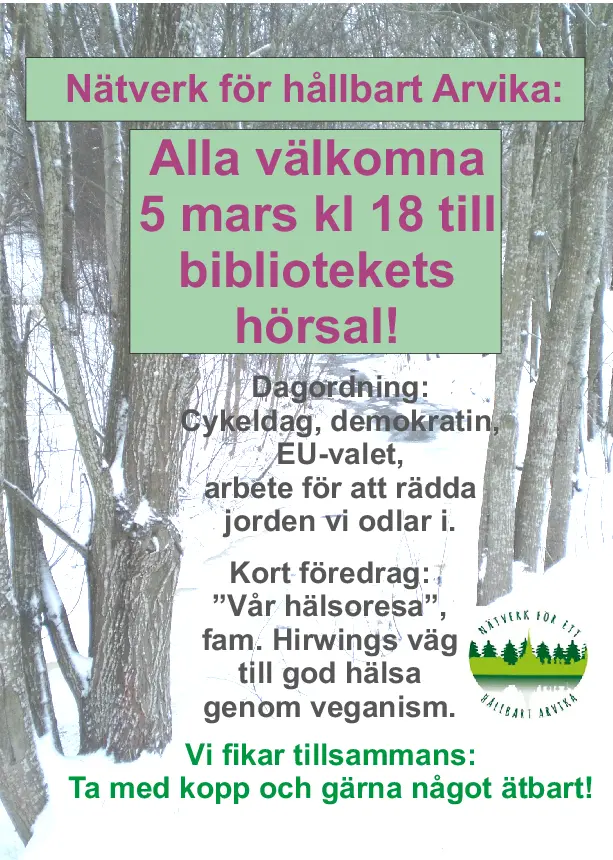

Nätverk för hållbart Arvika är en icke-organisation som träffas regelbundet
för att prata om iniativ som rör hållbarhet.

Jag har varit där och besökt deras möte en gång, samt pratat lite med dem
om våran syn på hållbarhet och hur det hänger ihop med veganism.

Så till nästa möte (som är den 5e mars 2024 kl 18:00 i hörsalen på Arvika
bibliotek) så har de bjudit in oss att föreläsa om just det.

[ facebook evenemang](https://fb.me/e/4ktOrV8DY)

